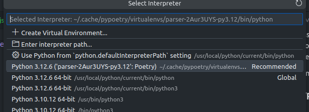

# parser

## Setup

This project requires Docker to be installed on your machine.

If you are using Windows, you must first install [WSL2](https://learn.microsoft.com/en-us/windows/wsl/install).

If you are using Linux, **not WSL on Windows**, you must have `docker` and `docker compose` installed.

If you are using MacOS, continue reading.

Then, install [Docker Desktop](https://www.docker.com/products/docker-desktop/) and make sure that Docker is running.


### VSCode

If you are using VSCode, install the [Dev Containers](https://marketplace.visualstudio.com/items?itemName=ms-vscode-remote.remote-containers) extension, you might already have it installed.

1. Open the project in VSCode.
2. Press `F1` and select `Dev Container: Open Folder in Container...`.
3. VSCode will build the Docker image and start the container.
4. Once the container is running, you can open a terminal in VSCode and run commands as if you were in the container.

All commands should be run in the container, inside the VSCode terminal. Think of this as a completely different computer... because it is. 

### Python/Poetry

Since we are using Poetry to manage python packages, you will need to run the following command to install the correct packages:

```
poetry install
```

Additionally, we use Poetry to manage our Python Virtual Environment. This is important because the versions of Python packages must match exactly to run the parser.

To activate the virtual environment, run the following command:

```
poetry shell
```

In VSCode, open any python file and at the bottom right of your screen you should see the python environment being used, see screenshot below:


On your side, click the button that is in the place of where it says "3.12.6" on my screenshot. Select the python virtual environment that includes the word `.venv`.

See below for an example (may not be exactly the same):




## Running

### Scraper: <br>
Note that PDFs will be stored in exam-specific directories in parser/pdfs.
```
python parser/scrape.py 
```
### Parser: <br>
```
python parser/parse.py <path to FE pdf>
```

Open `document.json` to see the parsed questions.

## Common Issues

### Permission denied

If you get a permission denied error, you will need to update the owner of the file to the user in the container.

From within the container, run the following command:
```
sudo chown -R vscode:vscode /workspace/parser
```